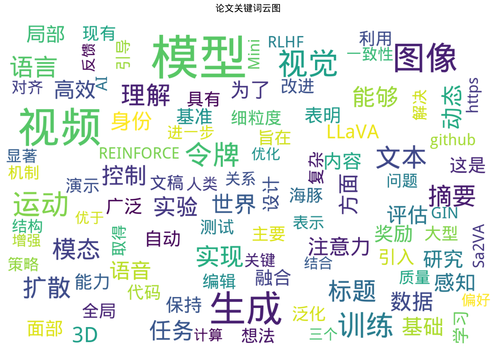
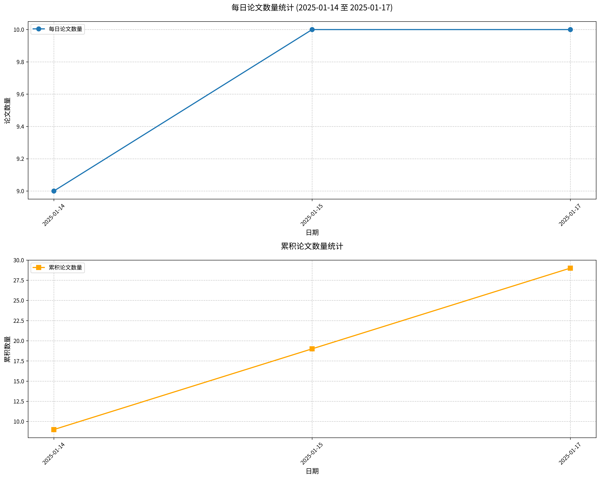

#  Hugging Face 2025-01-22 论文日报

## 📊 今日论文统计
- 总论文数：1
- 热门领域：LLM

## 📝 论文详情

### 1. Condor：通过知识驱动的数据合成与精炼增强大语言模型对齐

**原文标题：** Condor: Enhance LLM Alignment with Knowledge-Driven Data Synthesis and
  Refinement

**摘要：**
监督微调（SFT）数据的质量在提升大语言模型（LLMs）的对话能力方面起着至关重要的作用。然而，随着LLMs的不断进步，高质量人工标注的SFT数据的可用性已成为一个显著的瓶颈，这使得对合成训练数据的依赖变得更为必要。在本研究中，我们提出了Condor，一种新颖的两阶段合成数据生成框架，该框架结合了世界知识树和自我反思精炼，以大规模生成高质量的SFT数据。我们的实验结果表明，仅在20K Condor生成的样本上进行微调的基础模型，相较于其他模型，表现出了更优的性能。Condor中的额外精炼阶段进一步实现了不同规模（高达72B）LLMs的迭代自我改进，验证了我们方法的有效性。此外，我们对训练后合成数据扩展的研究揭示了性能提升的巨大未开发潜力，为未来的研究开辟了有前景的途径。

**论文链接：** [HuggingFace](https://huggingface.co/papers/2501.12273) | [arXiv](https://arxiv.org/abs/2501.12273)

---

## 🔍 关键词云图

## 📈 近期论文趋势

## 🎙️ 语音播报
- [收听今日论文解读](../audio/2025-01-22_daily_papers.mp3)

## 📱 订阅渠道
- GitHub: [hf-daily-paper-newsletter-chinese](https://github.com/2404589803/hf-daily-paper-newsletter-chinese)