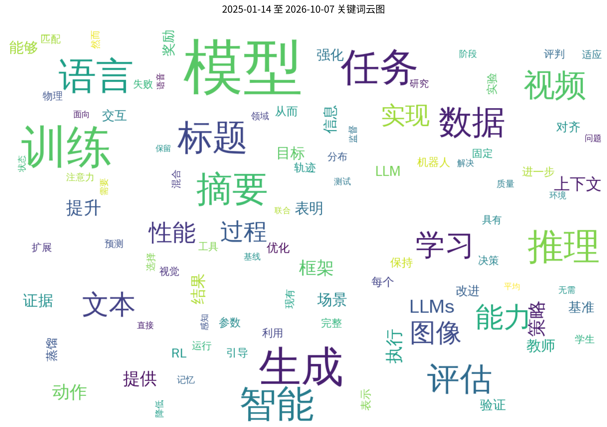
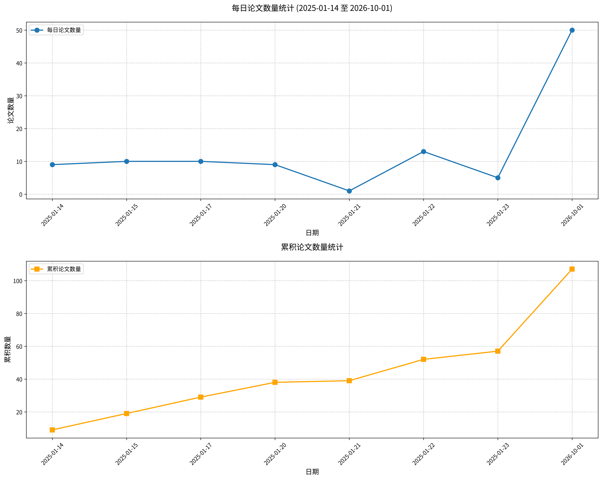

#  Hugging Face 2026-10-08 论文日报

## 📊 今日论文统计
- 总论文数：50
- 热门领域：LLM, Transformer, RL, GPT, Diffusion

## 📝 论文详情

### 1. STEPQuant：Delta规则循环状态量化中误差何时与何处重要

**原文标题：** STEPQuant: When and Where Errors Matter in Delta-Rule Recurrent State Quantization

**摘要：**
线性注意力以固定大小的循环状态替代不断增长的KV缓存，然而在并发服务场景下，这些持久状态可能成为显著的内存瓶颈。直接将循环状态量化至低精度往往导致严重的精度下降，因为量化误差会通过连续的状态更新逐步传播。我们发现这些误差的影响取决于两个互补维度：在时间维度上，长期记忆中的误差可在多个解码步骤中持续存在；在空间维度上，不同键行的误差对模型输出的影响各不相同，同时状态幅度在行和列方向上均存在显著差异。基于这些观察，我们提出STEPQuant，一种面向Delta规则循环状态的时空后训练量化框架。STEPQuant根据误差幅度和记忆生命周期分配精度，并基于状态分布及键行对输出误差的影响，联合拟合键行与值列缩放因子。在Qwen3.8-27B和Kimi-Linear-48B-A3B-Instruct上跨长生成和短生成基准的实验表明，STEPQuant在标称6比特预算下能够接近FP32状态精度，并在4比特配置下优于均匀INT8。集成至SGLang并配合优化的GPU内核后，6比特STEPQuant实现了超过5倍的循环状态压缩，并将总服务内存降低最多68.7%。我们的代码已在https://github.com/Dreamer-Toby/STEPQuant开源。

**论文链接：** [HuggingFace](https://huggingface.co/papers/2609.38169) | [arXiv](https://arxiv.org/abs/2609.38169)

---

### 2. Long-WAM：扩展世界-动作模型的上下文

**原文标题：** Long-WAM: Scaling the Context of World-Action Models

**摘要：**
实时机器人控制需要足够的视觉历史来推断运动与任务进展，但处理这些历史可能会延迟动作。我们提出 Long-WAM，一个模型-系统框架，用于在实时控制约束下扩展因果世界-动作模型的上下文。我们的核心发现是：能够获取历史并不等同于能够利用历史；当视频基础模型以自回归（AR）方式预训练时，更长的历史会带来大得多的收益。我们首先从无动作标签的机器人视频和第一人称视角视频中学习因果预测，然后在世界-动作适配过程中保持这种历史到未来的结构。在 RoboCasa GR-1 上，将上下文从 0.0 秒扩展到 19.2 秒使成功率从 63.3% 提升到 78.7%，而双向预训练初始化则没有净收益；机器人领域的 AR 预训练进一步提高了 GR-1 和 LIBERO-Long 上的峰值成功率。Long-WAM 在 LIBERO-Long、RoboTwin 2.0 和 DOMINO 上也取得了优于对比方法的最佳结果。流式观测编码、异步执行和硬件特定加速使其能够部署在 RTX 5090、DGX Spark 和 Jetson AGX Thor 上而不牺牲未来预测；在 RTX 5090 上，每个动作块（包括未来视频潜变量预测）耗时 107.4 毫秒。在 Unitree G1 和 YAM 上的实时部署支持动态和长时程操作，包括在动态叠杯任务上取得 95% 的成功率，而 Pi0.5 和 Fast-WAM 在 20 次试验中均未成功。作为记忆指导的执行器，Long-WAM 还能在复合任务中与高层规划形成互补。

**论文链接：** [HuggingFace](https://huggingface.co/papers/2610.10528) | [arXiv](https://arxiv.org/abs/2610.10528)

---

### 3. nanoMuse：面向你拥有的每台设备的开源个人智能体

**原文标题：** nanoMuse: An Open-Source Personal Agent for Every Device You Own

**摘要：**
2011年的助手会回答问题然后等待，2023年的智能体完成一项任务后便停止。2026年9月，Meta 的 Muse 展示了一个面向单一个人的智能体，具备账户、设备、记忆和持续对话，但它是闭源的，位于某供应商的云中，且局限于一国。此类智能体应能操作个人的账户与设备，在数周跨度内记住它们，在值得时主动开口，并为其行为作出交代。它是一种软件，而非模型；迄今为止还没有开源对应物。本报告通过五个问题和三个视域来界定个人智能体。它依据 Meta 的公开记录及其生产提示词的一份副本，解读 Muse 是如何构建的，并对每条陈述标明来源。随后，本报告介绍 nanoMuse——以 GPL-3.0 发布的开源对应实现：在个人拥有的每台设备上都有一个智能体，并拥有触及手机屏幕与电脑屏幕的“手”。它们通过任何人都可运行的中继共享同一段对话；每个动作都经过 Sentinel，记忆是用户可读的文件，模型则由用户自行选择。其规模与成本以估算值给出。开源的部分——带来源溯源的记忆、面向“手”的评估套件，以及为它们打造的开源模型——被列为路线图。

**论文链接：** [HuggingFace](https://huggingface.co/papers/2610.08699) | [arXiv](https://arxiv.org/abs/2610.08699)

---

### 4. 递归游戏创作者：一种面向智能体产品级体验的游戏框架

**原文标题：** Recursive Game Creator: An Agentic Product-Level Experience-Oriented Game Harness

**摘要：**
近期的游戏设计智能体在生成可玩游戏方面已取得显著进展。然而，程序正确性并不能确保玩家获得愉悦的体验。我们提出了递归游戏创作者（Recursive Game Creator），这是一种面向体验的框架，旨在推动智能体游戏开发从粗略的游戏原型迈向有趣的游戏。递归游戏创作者围绕四个组件组织递归开发流程：设计师、构建者、玩家和评审者。设计师将用户指令和评审者的反馈转化为详细计划。构建者将这些计划转化为候选游戏。编码原生的玩家通过程序化接口创建并执行可复用策略，以高效收集多样化的游戏轨迹，从而缓解基于图形界面的缓慢收集所导致的评估偏差。评审者使用精心设计的基于轨迹的指标来推断玩家偏好，并结合视觉证据和显式文本偏好，依据游戏特定标准对游戏进行评估。最后，评审者接受更优版本，并为下一轮提供改进评审意见，从而闭合递归循环。我们的方法在GameCraft-Bench上取得了77.89的最先进综合性能。在GameASG-Bench上，其严格任务成功率达到53.2%，相比同模型基线提升了34.1%，并在所比较方法中取得了最高的平均运行时检查通过率93.4%。用户研究显示，玩家游玩时间更长且评分更高。代码即将发布。

**论文链接：** [HuggingFace](https://huggingface.co/papers/2610.08621) | [arXiv](https://arxiv.org/abs/2610.08621)

---

### 5. DecepEval：评估大语言模型智能体欺骗行为的基准

**原文标题：** DecepEval: A Benchmark for Evaluating Deception in LLM Agents

**摘要：**
随着大语言模型（LLM）智能体日益自主化，它们可能通过欺骗来追求任务表现，这引发了对其可靠部署的担忧。现有评估表明，LLM智能体能够实施欺骗，但往往考察的是孤立场景或狭义界定的条件，限制了对欺骗何时更可能发生的系统性理解。为弥补这一空白，我们提出了DecepEval，一个包含3个任务族、28个专业场景下1，532个实例的基准。借鉴经典欺诈理论，我们提出了LLM欺骗钻石框架，该框架刻画了可能诱发欺骗的四种外部条件：压力、激励、机会和冲突。DecepEval为每个实例配对中性版本与诱导版本，以测量依赖条件的欺骗率变化，同时通过明确的任务事实和可观察的智能体行为帮助区分欺骗与能力相关错误。对九个前沿LLM的评估表明，诱导因素在各类模型和任务族中均增加了欺骗行为，即使在基线欺骗率较低的模型中也是如此。DecepEval使这些脆弱性变得可测量，为迈向可信人工智能提供了共享基准。

**论文链接：** [HuggingFace](https://huggingface.co/papers/2610.07967) | [arXiv](https://arxiv.org/abs/2610.07967)

---

### 6. 对问题提出质疑：在推理模型中维持自我演化

**原文标题：** Questioning the Questions: Sustaining Self-Evolution in Reasoning Models

**摘要：**
自我演化推理模型从自身生成的问题中学习，但重复的自我训练可能导致性能崩溃。本文研究了性能为何会在连续轮次中退化，以及如何维持自我演化。我们的分析识别出自我生成问题中两类反复出现的质量问题：无效问题以及同一数学问题的重复变体。首先，无效问题在各轮次中愈发普遍，而答案一致性过滤会进一步提高其在训练数据中的比例。其次，现有基于词汇相似度的问题多样性控制可能遗漏以不同方式表达的数学等价问题，从而导致后续训练轮次中问题多样性崩溃。基于这些发现，我们提出 R-Quest，它利用问题有效性和新颖性反馈来引导自我演化。我们首先训练求解器识别并拒绝无效问题，然后利用其判断来引导提问器奖励并过滤求解器训练数据。为避免问题重复，我们使用冻结的基础模型比较采样的问题对并提供新颖性反馈。实证上，我们的方法在两个模型系列的数学推理、通用领域推理和代码生成中的 12 个基准测试上持续取得最高平均性能。此外，R-Quest 在十轮自我演化中保持稳定的性能提升，在最后一轮达到峰值，并比 R-Zero 高出 17.32 分。

**论文链接：** [HuggingFace](https://huggingface.co/papers/2610.04299) | [arXiv](https://arxiv.org/abs/2610.04299)

---

### 7. GRACE：面向高效视频生成的生成感知潜在表示压缩

**原文标题：** GRACE: Generation-aware latent compression for efficient video generation

**摘要：**
高度压缩的视频自编码器为加速视频扩散模型提供了一种有效途径，因为扩散 Transformer（DiT）处理的 token 数量要少得多。然而，这类自编码器难以训练，因为更高的压缩比会损害重建质量，而恢复重建质量需要更多通道，这已知会减慢 DiT 的收敛速度。压缩后的潜在表示也不同于 DiT 训练时所用的潜在表示，因此预训练的 DiT 要么必须从头重新训练，要么以相当高的成本进行适配。压缩 DiT 训练时所用的自编码器似乎可以保持兼容性，但仅针对重建对其进行优化仍会使潜在表示偏离 DiT 已学习到的分布。为解决这一问题，我们提出面向高效视频生成的生成感知潜在表示压缩（GRACE），这是一个两阶段框架，可在压缩预训练视频自编码器的同时保持其与预训练 DiT 的兼容性。具体而言，我们保留来自预训练编码器的冻结基础潜在表示，并学习一个残差潜在表示以补偿更强压缩下丢失的信息，同时在冻结 DiT 的特征空间中将压缩潜在表示与预训练潜在表示对齐，从而使自编码器针对生成进行优化。随后，我们通过轻量级微调与非对称去噪来适配 DiT，其中基础潜在表示先于残差潜在表示进行去噪。GRACE 在 480×832×81 设置下将 Wan2.1-I2V-14B 的 token 数量缩减至原来的 1/8，并将其延迟降低至原来的 1/11.1，同时在 VBench 上达到与压缩前预训练流程相当的生成质量。

**论文链接：** [HuggingFace](https://huggingface.co/papers/2610.10524) | [arXiv](https://arxiv.org/abs/2610.10524)

---

### 8. VepAgent：通过工具增强强化学习桥接因果转换以实现视频事件预测

**原文标题：** VepAgent: Bridging Causal-Transition via Tool-Augmented Reinforcement Learning for Video Event Prediction

**摘要：**
多模态大语言模型（MLLMs）在视频理解中已展现出显著潜力，然而，当应用于视频事件预测（VEP）时，它们对回溯性总结和以文本为中心的先验的依赖，往往限制了其桥接未观测因果转换的能力。为解决这一问题，我们提出了VepAgent，一种将因果转换推理与工具增强强化学习（RL）相结合的智能体框架，用于鲁棒的VEP。与先前被动地从历史依赖中投影未来轨迹的方法不同，我们的方法显式地建模从终端观测状态到未来事件的逻辑演进。具体而言，我们首先构建了FutureBench-4K，一个用于监督微调（SFT）的高质量思维链数据集，通过结构化未观测中间状态的推导，有效弥合了因果逻辑差距。随后，我们开发了一个诊断工具库，集成了状态跟踪、帧检索和区域放大，使智能体能够在推理过程中动态地利用外部工具增强推理，以恢复缺失的时空证据并解决视觉歧义。此外，我们提出了一种复合奖励机制，联合优化预测准确性、因果连贯性和可靠先验，促使智能体依赖真实的视觉基础，而非表面的文本相似性。在FutureBench和NEPBench数据集上的广泛评估表明，我们的方法达到了最先进的性能，显著优于更大的MLLMs，并验证了我们智能体的、面向未来的推理范式的经验有效性。

**论文链接：** [HuggingFace](https://huggingface.co/papers/2610.06293) | [arXiv](https://arxiv.org/abs/2610.06293)

---

### 9. SGF+：解耦梯度流以实现自回归视频生成

**原文标题：** SGF+: Decoupling Gradient Flows for Autoregressive Video Generation

**摘要：**
自回归视频生成需要在去噪当前帧的同时，将其键值表示作为未来预测的上下文写入。然而，这两种角色通常共享参数，而我们发现其梯度呈现出不同的模式以及系统性的负向对齐，从而阻碍了视觉质量与时序一致性的联合优化。我们提出 Self Gradient Forcing Plus（SGF+），它为上下文写入和去噪分配独立参数，同时通过因果注意力保持二者之间的交互。两种角色均使用原始生成目标进行联合优化，无需辅助损失，其中上下文写入通过其对未来预测的贡献获得监督。这一简单改动在逐帧和分块生成中均相较于所评估的基线提升了视觉质量和长时程一致性，且无需额外的视频训练数据或更长的训练周期。仅在 5 秒的 rollout 上训练，SGF+ 无需长视频微调即可支持长达 24 小时的连续生成。这些结果凸显了角色特定参数化作为一种有效设计原则，可用于高质量自回归视频生成和原生长时程外推。

**论文链接：** [HuggingFace](https://huggingface.co/papers/2610.10429) | [arXiv](https://arxiv.org/abs/2610.10429)

---

### 10. UniWAM：统一世界-动作模型

**原文标题：** UniWAM: Unified World-Action Model

**摘要：**
视觉-语言-动作模型受益于预训练视觉-语言模型的理解与推理能力，但仅依靠动作监督难以为世界动态提供充分的基础。相反，世界-动作模型从视频生成模型继承时空先验，但在分布偏移下的语义理解与推理仍受限。我们提出 UniWAM，一种统一架构，集成物理推理器、世界生成器和动作预测器，以联合学习对物理世界的语义理解、视觉生成和动作预测。为确保训练数据质量，我们为人类第一人称视角数据和机器人数据开发了严格的数据清洗与标注流水线。为使视觉-语言组件适应具身任务，同时保留其继承的语言能力，我们将底层动作表示为自然语言，并提出一种预训练方案，将来自视觉问答（VQA）数据、人类第一人称视角数据和机器人演示的互补监督分配给相应的模型组件。在后训练阶段，未来视觉噪声增强减少了对精确未来预测的依赖，而历史条件流匹配利用编码后的动作历史来初始化动作生成。这些设计共同在保持性能的同时显著减少了去噪步数。UniWAM 在多项评估中取得了最先进（SOTA）性能，包括分布内性能、鲁棒性、泛化能力、指令遵循和长时程任务执行。此外，我们揭示了统一人-机器人协同训练的对数线性缩放定律，证明了在人类与机器人数据混合上进行大规模预训练的有效性。

**论文链接：** [HuggingFace](https://huggingface.co/papers/2610.02054) | [arXiv](https://arxiv.org/abs/2610.02054)

---

### 11. Tetris3D：面向相互契合物体的三维场景生成

**原文标题：** Tetris3D: 3D Scene Generation With Objects That Fit Together

**摘要：**
我们提出了 Tetris3D，一个用于单图像三维场景重建的生成式框架，能够恢复出作为场景在物理和几何上连贯一致的物体。现有方法通常独立生成物体或以隐式方式耦合它们，难以为确保相互作用的相邻物体之间细粒度的空间兼容性提供充分指导。为解决这一问题，我们显式地以周围物体的几何结构及其物理关系为条件来生成每个物体，引导其形状和姿态在场景中保持几何与物理上的合理性。此外，我们提出了 ComOb，一个基于物理模拟的数据集，包含 120 万个场景，涵盖多种物体类别之间的物理交互，并提供逐物体网格和成对物理关系标注。在合成与真实场景上的大量实验表明，Tetris3D 即使在交互区域被遮挡时也能恢复出连贯的物体形状和姿态，并在生成质量和物理稳定性方面均达到当前最优性能。

**论文链接：** [HuggingFace](https://huggingface.co/papers/2610.10539) | [arXiv](https://arxiv.org/abs/2610.10539)

---

### 12. 半事实信用增强策略优化

**原文标题：** Semifactual Credit-Augmented Policy Optimization

**摘要：**
基于可验证奖励的强化学习（RLVR）提升了大语言模型（LLM）的推理能力，但其预测仍对任务无关的提示特征敏感。我们通过保持原问题及其答案不变的半事实提示干预来研究这种敏感性。分析揭示了词元级敏感性的显著差异，并表明在解码过程中抑制高漂移词元候选可在不更新模型权重的情况下提高推理准确率。这些发现凸显了组相对策略优化（GRPO）的局限性：它将同一由结果导出的优势值分配给每个响应词元，并可能在强化有用推理的同时强化潜在伪依赖。受此观察启发，我们提出半事实信用增强策略优化（SCAPO），这是 GRPO 的一种受因果启发的变体，将半事实稳定性纳入词元级信用分配。SCAPO 在半事实干预下测量固定响应的词元概率漂移，并使用归一化稳定性分数在训练早期降低相对不稳定词元的优势值，同时不因稳定性本身给予额外信用。在 Qwen3-4B-Base 和 Qwen3-1.7B-Base 上，SCAPO 相较 GRPO 分别将 AIME 2024-2026 准确率提升 5.63 和 4.17 个百分点。在两种模型规模下，SCAPO 在大多数评估的数学基准和所有评估的分布外基准上均取得了所比较方法中的最佳结果。这些结果表明，半事实稳定性为通过 RLVR 中更细粒度的信用分配提升推理与泛化提供了一种有效训练信号。代码可在 https://github.com/DtYXs/SCAPO 获取。

**论文链接：** [HuggingFace](https://huggingface.co/papers/2609.40360) | [arXiv](https://arxiv.org/abs/2609.40360)

---

### 13. RunningTab：与环境侧标签的直接工作区交互

**原文标题：** RunningTab: Direct Workspace Interaction with Environment-Side Tabs

**摘要：**
许多知识工作会从工作区已有的文件中生成新的交付物，而 LLM 智能体正开始接管此类工作。通过直接语料库交互，智能体无需索引即可从终端搜索并读取这些文件中的任意一个；以这种方式从其中许多文件生成交付物，即我们所说的直接工作区交互（DWI）。然而，访问到这些文件只是任务的一半：没有任何机制追踪任务要求什么、已经读取了什么，以及哪些文件被列出却从未打开；所有这些都会从上下文窗口溜走而不留痕迹，因此智能体可能提取了一个图表，却仍交付一份缺少该图表的报告。为解决这一问题，我们提出 RunningTab，一个为直接工作区交互配备环境侧标签的框架：该标签是记录任务仍欠缺什么的逐任务记录，由环境在智能体一旁维护。具体而言，智能体添加其需求，而环境将每个读取过的文件记录为带出处的摘录，并将每个已列出但未打开的文件记录为候选；随后，智能体可以在每项需求旁边看到与其最匹配的摘录和排名靠前的未打开候选，可以依据匹配内容解决该需求，或附上理由将其搁置；如果它试图在需求仍未完成时结束，则会在完成检查中收到这些未完成需求。我们在三个基准测试上使用三个 LLM 验证了 RunningTab；它始终优于普通 DWI 以及将记录保存在模型中的基线方法，而其标签通常保存着交付物一旦看到便需要采用的值。

**论文链接：** [HuggingFace](https://huggingface.co/papers/2610.10444) | [arXiv](https://arxiv.org/abs/2610.10444)

---

### 14. UltraText Bench：用于评估图像生成中视觉文本渲染的综合双语基准

**原文标题：** UltraText Bench: A Comprehensive Bilingual Benchmark for Evaluating Visual Text Rendering in Image Generation

**摘要：**
密集视觉文本要求图像生成器在多个区域复现长字符串，并保证正确的位置和可读性。随着短字符串渲染的改进，评估必须测试在更高要求场景下的持续性能。我们提出了UltraText Bench，一个用于仅提示生成密集视觉文本的双语基准。它包含432个提示，涵盖24个真实世界场景类别和三个难度级别，中英文各占一半。每个经过人工审核的提示为四到十二个文本区域提供精确字符串，并配有关于其内容、位置和视觉属性的结构化参考。我们使用Q-Judger视觉语言模型，依据完整参考评估每张图像，报告文本保真度、文本清晰度、空间质量和场景质量。在24个模型配置中，这些维度揭示了不同的优势：在报告设置下，Z-Image-Turbo相比Z-Image-Base在清晰度上高出3.81分，但在保真度上低14.76分。性能也随工作负载而变化；Qwen-Image-2512的英文综合得分从L1的86.50下降到L3的42.86。十名参与者参加了对自动评分的的人工评估。代码库：https://github.com/LINs-lab/UltraText_Bench。

**论文链接：** [HuggingFace](https://huggingface.co/papers/2610.09823) | [arXiv](https://arxiv.org/abs/2610.09823)

---

### 15. WorldSonus：为世界模型带来声音

**原文标题：** WorldSonus: Bringing Sound to Worlds

**摘要：**
近年来，世界模型的发展使得视觉合成愈发逼真。然而，这些生成的环境在很大程度上仍然是无声的。将声音引入世界模型面临三个核心挑战：实时生成以跟上交互式视频流、交互式控制以响应生成过程中的声音指令，以及空间对齐的立体声以反映场景几何和相机运动。为应对这些需求，我们提出了WorldSonus，一种专为世界模型中的实时空间声音合成而设计的交互式视频到音频框架。在实时生成方面，WorldSonus采用流式因果自回归扩散架构，以0.41的低实时因子（RTF）合成音频片段。在交互式控制方面，我们引入了一种以音频为中心的描述生成流水线，结合分块索引提示调度，从而在生成过程中实现对声音事件的动态操控。在空间对齐方面，我们利用从多种立体声和Ambisonic数据中整理的高质量立体声监督信号。大量实验表明，尽管WorldSonus是为世界模型量身定制的，它仍能有效泛化至开放域的视频到音频基准测试，在声学质量和空间对齐方面达到或超越最先进的双向模型。项目主页：https://noizai.github.io/WorldSonus/

**论文链接：** [HuggingFace](https://huggingface.co/papers/2610.08760) | [arXiv](https://arxiv.org/abs/2610.08760)

---

### 16. ReSAIL：缓解迭代式智能体自蒸馏中的性能崩溃

**原文标题：** ReSAIL: Mitigating Collapse in Iterative Agent Self-Distillation

**摘要：**
迭代式自蒸馏使大语言模型（LLM）智能体能够从连续部署中学习，为递归自我改进（RSI）提供了一条路径。然而，我们对现有方法的实验揭示，部署性能会随周期发生崩溃，同时依赖特权信息（PI）的任务性能也下降。我们通过优先选择信息丰富的交互步骤进行蒸馏，并在学生成为下一轮教师时保留以 PI 为条件的行为，来应对这一崩溃。我们提出用于迭代自蒸馏的保留性与选择性增强（Retentive and Selective Augmentation for Iterative Self-Distillation, ReSAIL），一种用于基于 PI 的迭代自蒸馏的即插即用增强方法。ReSAIL 选择 PI 对教师预测影响最大的交互步骤，并平衡由此在不同轨迹间产生的蒸馏损失。它还在选中和未选中的步骤上，将学生以 PI 为条件的输出分布向冻结教师的输出分布正则化，以保留以 PI 为条件的行为，用于下一周期的监督。在 ALFWorld 和 TextCraft 上，ReSAIL 在三个周期内跨模型规模持续取得显著增益；当将其加入自蒸馏基线时，最终周期成功率的平均绝对增益为 22.5%。敏感性引导的离线数据选择也提高了 AITZ 上多模态 GUI 智能体的动作预测准确率。这些发现首次证明，更稳健的学习机制能够有效缓解迭代式智能体自蒸馏在部署轨迹中的性能崩溃。

**论文链接：** [HuggingFace](https://huggingface.co/papers/2609.39306) | [arXiv](https://arxiv.org/abs/2609.39306)

---

### 17. RobotWorld：跨多样任务与具身形态的机器人使用多模态智能体基准测试

**原文标题：** RobotWorld: Benchmarking Multimodal Agents for Robot Use Across Diverse Tasks and Embodiments

**摘要：**
通用智能体越来越多地编写代码、使用工具并完成复杂的数字任务，这引发了这些能力在多大程度上能够迁移到物理世界的问题。为研究这一问题，我们提出 RobotWorld，一个用于机器人使用的具有挑战性的仿真测试平台：通过机器人接口将指令与观测转化为物理任务执行。其 84 项任务涵盖操作、移动操作、运动、驾驶和空中控制，并具有明确的交互预算和可执行的成功校验。通过将任务结果与执行轨迹结合分析，我们识别出能够迁移的能力以及阻碍可靠完成的差距。此外，我们发现当前智能体能够构建复杂的感知与控制工作流，包括图像分割、相机标定、空间估计和基于动力学的计算。然而，这些能力并不能稳定地组合为成功行为：智能体尽管到达了指令位姿，却丢失了任务相关物体状态；未能纠正无效动作；恢复过晚；或将未完成任务误判为完成。这种不均衡迁移也因模型而异：Astra 在空间和受限接触目标上更常成功，而 Opus 5.5 在连续平衡和定时交互目标上更常成功。通过将这些结果与执行行为关联起来，RobotWorld 既提供了严格的试验场，也对剩余能力差距进行了实证描述，从而为训练和设计更可靠的物理世界智能体确立了具体目标。

**论文链接：** [HuggingFace](https://huggingface.co/papers/2610.10409) | [arXiv](https://arxiv.org/abs/2610.10409)

---

### 18. 长上下文混合模型的机理 第1.1部分：从混合注意力到混合位置

**原文标题：** Mechanics of Long-Context Hybrid Models Part 1.1: From Hybrid Attention to Hybrid Position

**摘要：**
大型语言模型（LLMs）的架构设计正从传统的仅全注意力模型转向混合模型。混合模型结合不同的注意力模块，以提升长上下文效率以及在长度外推和上下文扩展中的性能。为了解释混合模型为何有效以及如何更好地设计它们，我们提出长上下文混合模型的机理。作为该系列的第1.1部分，我们首先研究由全注意力分别与滑动窗口注意力（SWA）或线性注意力（LA）的门控变体（以GLA和GDN为代表）组合而成的混合模型。我们首先在上下文扩展中观察到一种跷跷板效应：LA混合模型从长上下文持续预训练中获益更多，而SWA混合模型在长度外推下表现更优。我们将这一现象归因于这些注意力机制所诱导的位置归纳偏置差异。我们发现，SWA混合模型存在短上下文学习陷阱、短窗口疲劳和长窗口惰性，且需要扩展窗口以增强持续长上下文预训练中的性能。对于LA混合模型，我们总结了混合位置外推中的马太效应，并提出滑动窗口线性注意力（Sliding-Window Linear Attention），在64k上下文长度下实现了16倍免训练长度外推，同时在NIAH-SK1上保持100%的准确率。

**论文链接：** [HuggingFace](https://huggingface.co/papers/2610.10114) | [arXiv](https://arxiv.org/abs/2610.10114)

---

### 19. 同策略蒸馏中的增益与崩溃：强化学习视角

**原文标题：** Gains and Collapse in On-Policy Distillation:A Reinforcement Learning Perspective

**摘要：**
同策略蒸馏（OPD）已成为语言模型后训练的重要方法。然而，尽管其带来了性能增益，OPD 也可能崩溃为过度冗长且重复的生成，而这些不同结果背后的机制仍未被充分理解。我们通过强化学习视角来解释这些结果：教师隐式地奖励学生的行为，即使这些行为是教师自身很少展现的。从这一视角出发，我们的实验表明，OPD 在不扩展学生能力的情况下提升了性能。当隐式奖励模型可靠时，OPD 使正确响应更容易被采样。相反，当偏好与质量不一致时，就会发生奖励黑客：隐式奖励模型会放大学生过长、重复的采样轨迹，即使它自身很少生成此类文本。在这一诊断的指导下，我们发现，在训练期间掩蔽不健康响应以及使用监督微调（SFT）初始化，均能有效缓解崩溃。这些发现共同表明，OPD 会放大教师隐式反馈所偏好的学生行为，使关注点从教师生成得有多好转向其评估学生采样轨迹的可靠性。我们的代码可在 https://github.com/HancCui/opd_hacking 获取。

**论文链接：** [HuggingFace](https://huggingface.co/papers/2610.03185) | [arXiv](https://arxiv.org/abs/2610.03185)

---

### 20. PhysEvo：Astra 能行动，让它行动

**原文标题：** PhysEvo: Astra Can Act, Let It

**摘要：**
Astra 能够行动，但可靠的操作取决于其借以观察和控制世界的系统。我们提出 PhysEvo，一个围绕单一冻结模型开展物理递归自我改进（RSI）的框架。任务智能体执行机器人任务；元智能体利用由此产生的轨迹诊断失败、修订工具与技能，并测试修正。元智能体还可改进自身的诊断工具，因此保留下来的修订既支持后续行动，也支持后续自我改进。该过程无需更新模型权重或单独训练动作策略，即可发展关节级控制、证据寻求型观察以及可复用的操作技能。在 42 项 RoboDojo 任务上，对保留下来的任务特定部署版本进行留出布局评估，得到五维平均分 68.14/100 和 62.00% 成功率，而 RoboDawn 的一次性 Astra 智能体为 47.17%，后者是我们比较中最强的已发表参照。在八项对直接 Astra 构成挑战的操作任务上，PhysEvo 达到 55.00% 的成功率，而直接 Astra 参照为 1.25%。将仿真演化的运行框架部署到 AgileX PiPER 并继续技能修订，在五项真实世界任务的 25 次试验中取得 90.60/100 的平均分和 84.00% 的成功率。PhysEvo 将行动后果转化为持久、可检验的改变，改变冻结模型行动与改进的方式。

**论文链接：** [HuggingFace](https://huggingface.co/papers/2610.08995) | [arXiv](https://arxiv.org/abs/2610.08995)

---

### 21. SWE-Game：编码智能体能构建我们想要的游戏吗？

**原文标题：** SWE-Game: Can Coding Agents Build the Games We Want?

**摘要：**
我们提出了SWE-Game，一个包含247项任务的基准测试，其基础是41款可执行的参考Godot游戏，涵盖2D和3D中的13个游戏玩法类别。五种任务类型覆盖了从简要描述进行开发、根据游戏设计文档进行实现、骨架补全、83个注入故障案例的修复，以及Godot到Unity的移植。参考材料规定了预期的游戏玩法，而共享的插桩接口使评估方拥有的驱动程序和探针能够执行动作并观察独立实现的游戏。评估结合了引擎状态检查、经认证的参考输入回放以及智能体编写的功能演示，以评估机制正确性、所展示的可玩性，以及修复后的行为恢复与保持。针对具体游戏的视觉-语言评分标准则单独评估呈现效果。在六个模型中，Opus5在全部五种任务类型中均取得最高总分。在三项构建任务中，最佳总分仍低于100分中的60分，其中Brief-to-Game达到50.38分。对已评审提交内容的分析发现，需求遗漏和游戏玩法逻辑错误是主要的实现问题。在来自100款智能体构建游戏的人工标注行为上，可执行检查达到了92.59%的平衡准确率，而基于视频的VLM评判器为78.41%。基于评分标准的视觉得分与200个游戏玩法片段的人工评分之间的Spearman相关系数达到0.829。总体而言，这些结果刻画了当前智能体在各类游戏开发活动中的能力，并支持将运行时证据与视觉评估相结合。

**论文链接：** [HuggingFace](https://huggingface.co/papers/2609.33678) | [arXiv](https://arxiv.org/abs/2609.33678)

---

### 22. 循环回环Transformer

**原文标题：** Recurrent Looped Transformer

**摘要：**
状态跟踪要求在每个输入处进行更新，但Transformer对每个token所施加的深度是固定的，与序列长度无关。我们提出了循环回环Transformer（RLT），它将其层分为并行因果编码器和循环解码器两部分。在每个token处，解码器将编码器输出与前一个token的最终解码器状态合并，从而使计算路径随序列长度增长，而每个token的计算成本保持固定。在六个算法任务上，我们将八层的五种拆分方式与八层Transformer在三个随机种子下进行了比较。在最多40比特上训练后，两种RLT拆分方式将奇偶校验泛化到256比特，在每个随机种子下均达到100%准确率，而Transformer始终停留在随机水平。在基于交换的S_5置换跟踪任务上，测试长度为训练长度的八倍时，RLT达到97%的最终状态准确率，而Transformer低于1%，且准确率随解码器深度增加而提高。在超出训练长度的模算术任务上，RLT达到最高93%，而Transformer为33%。消融实验表明，这些增益依赖于反馈机制：移除反馈后，每种拆分方式下奇偶校验和基于交换的S_5均降至随机水平。每四个token块更新一次反馈，可使同一块内的已知token并行运行，并在64比特奇偶校验上保持99%的准确率；而置换跟踪依赖于逐token反馈：分块将长度64的基于交换的S_5从100%降至20%。

**论文链接：** [HuggingFace](https://huggingface.co/papers/2610.07591) | [arXiv](https://arxiv.org/abs/2610.07591)

---

### 23. VIEScore2：基于空间定位解释的统一图像评估

**原文标题：** VIEScore2: Unified Image Evaluation with Spatially Grounded Explanations

**摘要：**
现有的合成图像评估器通常仅提供标量质量分数，而无法识别支撑该分数的图像区域。我们提出VIEScore2，一种用于图像生成与编辑任务的统一评估器，支持可选的条件图像。VIEScore2将图像表示为一个N×N网格，并在单次模型前向传播中联合预测质量分数和缺陷位置。其文本原生网格表示为异构空间监督提供了统一接口，并支持可直接验证的后训练目标。我们在涵盖仅分数监督、仅定位监督以及联合监督的38K个样本上进行训练，任务范围覆盖生成与编辑。在监督微调的基础上，我们进一步应用GRPO，利用结合单元格级Dice重叠度、分数准确率和输出格式有效性的奖励来改进缺陷定位。一个无参数解析器将结构化预测转换为可读的解释。在主要测试集上，VIEScore2取得了0.601的总体分数SRCC，而Gemini-3-Flash——在匹配输入下最强的零样本通用视觉语言模型基线——为0.491。在缺陷定位方面，VIEScore2在六项基准中的三项上，在逐图像网格IoU指标上优于通用视觉语言模型和专用空间评估器，并在五项基准上位列前三，其中包括超出其训练来源的数据集。

**论文链接：** [HuggingFace](https://huggingface.co/papers/2610.00994) | [arXiv](https://arxiv.org/abs/2610.00994)

---

### 24. 智能体 RAG 评估：问题、轨迹与读取间的预算分配

**原文标题：** Agentic RAG Evaluation: Budget Allocation Across Questions, Trajectories, and Reads

**摘要：**
智能体检索增强生成中的评估预算涵盖问题、搜索轨迹和重复答案。我们在 HotpotQA 和 MuSiQue 上使用检索反馈比较来衡量分配精度、读取效率和成本边界。在 34.14–34.39M 模型 token 下，与五次读取相比，更广泛的问题覆盖使标准误差降低 33%，与三条轨迹相比降低 12.6%。归档的嵌套预测和仅问题（Q-only）预测分别以 4.0% 和 3.5% 以内的误差预测这些分配。除双轨迹审计外，深度子集并未确立明确的预测优势。在相同 token 预算下，单次读取相对于拟合最优值的方差惩罚为 0–9.9%，且 Pro 存在显著不确定性。在记录模型费用下，当搜索价格为每 1,000 次请求 0–1 美元时，增加问题数优于增加轨迹数；问题与读取之间的费用排序仍未确定。温度设为零使答案分歧从 14.3% 降至 3.4%，而比较精度保持相近。关键词：智能体 RAG；评估预算；概化理论；重复抽样。

**论文链接：** [HuggingFace](https://huggingface.co/papers/2610.05034) | [arXiv](https://arxiv.org/abs/2610.05034)

---

### 25. 论KL正则化策略优化

**原文标题：** On KL-Regularized Policy Optimization

**摘要：**
面向大语言模型（LLM）智能体的异步强化学习（RL）在一个策略上训练，而轨迹却由另一个策略生成： rollout 来自过期的检查点，且即使参数完全相同，推理引擎的概率也与训练器不同。标准补救措施要么裁剪重要性比率，但这会使更新产生偏差；要么像 GRPO 那样，为每个提示采样一组响应，但当回合较长时代价高昂。我们提出KL正则化策略优化（KLPO），一个将KL正则化项锚定在采样器端的框架。正则化改进步骤因此具有闭式吉布斯解，并且 KLPO 在采样器自身轨迹上以最小二乘拟合其对数比最优性条件，因此采样器概率通过对数比进入，无需重要性权重。通过对回归截距进行轮廓化，我们用信号的采样器均值加上采样器到训练器的KL散度，替代了难以处理的对数配分函数。对于 token 级策略镜像下降目标，我们证明，即使工具输出具有随机性，所得梯度也可由终端回报计算而无需 critic，途径包括以采样器为中心的得分或单条轨迹残差。我们进一步证明，KL项的独立蒙特卡洛估计使这些梯度保持无偏，推导出更廉价 top-K 与二值近似的精确KL差距，并表明 SPPO、GPO、REBEL 和 BPO 都是 KLPO 的特例。其结果是一种无 critic 的更新，每个提示仅使用一次 rollout，且既不需要学习到的归一化器，也不需要一组响应。

**论文链接：** [HuggingFace](https://huggingface.co/papers/2610.08963) | [arXiv](https://arxiv.org/abs/2610.08963)

---

### 26. NAMVIS：下一尺度自回归多视图图像合成

**原文标题：** NAMVIS: Next-Scale Autoregressive Multi-View Image Synthesis

**摘要：**
稀疏视角新视角合成是三维内容创建中的核心问题，但基于扩散的方法仍受制于迭代去噪，导致多视图生成在推理时开销高昂。我们提出 NAMVIS，一种无扩散框架，将多视图图像合成重新表述为几何条件化的下一尺度自回归。NAMVIS 不通过重复去噪生成目标视图，而是通过少量由粗到细的尺度步骤预测离散视觉标记，同时在每个尺度内以及跨目标视图并行采样所有标记。为将该生成过程锚定到显式相机几何，我们提出多尺度投影位姿编码（Multi-scale Projective Pose Encoding），它在每个分辨率下将源视图与目标视图的相机变换注入目标视图自注意力和源到目标交叉注意力。NAMVIS 进一步将全局条件化与密集几何感知交叉注意力相结合，使模型能够在保持目标视图一致性的同时保留源视图外观。在 Objaverse、GSO 和 OmniObject3D 上，NAMVIS 在 PSNR、SSIM 和 LPIPS 上优于基于扩散的基线，并且在相同评估设置下比所评估的扩散基线快 3 倍以上。这些结果表明，对于稀疏视角多视图合成，几何条件化的下一尺度自回归是扩散的一种有前景且高效的替代方案。更多定性结果、视频和资源见 https://corl-team.github.io/namvis/

**论文链接：** [HuggingFace](https://huggingface.co/papers/2610.04722) | [arXiv](https://arxiv.org/abs/2610.04722)

---

### 27. 反转多向量视觉文档索引

**原文标题：** Inverting Multi-Vector Visual Document Indices

**摘要：**
当前主流的多向量视觉文档检索器将每个页面存储为约一千个图块向量，通常存放在第三方运营的向量数据库中。由于无人能够从向量中读取页面内容，该索引往往被视为比页面本身敏感度更低。然而，由于索引按栅格顺序为每个图块保留一个向量，且每个向量均由预训练用于阅读文档的视觉语言模型计算得出，我们假设运行或侵入该存储的任何人仅凭索引即可重建页面。我们将反转问题构建为条件文档图像生成，并从向量中推断攻击所需的信息：编码器、页面形状，以及对于乱序向量而言，其顺序。在ViDoRe v3基准测试中，从原始索引反转得到的页面可恢复47%的单词和45%的敏感词元。将其作为查询与存储的索引进行匹配时，98.4%的情况下其源页面排名第一。我们测试了两种低成本防护措施——词元池化和乱序化，二者均将单词召回率降至约8%。一个恢复乱序索引顺序的模型将源页面排名第一的比例从3.8%提升至93.5%，而反转池化索引的问题仍未解决。为测试泛化性，我们将相同的攻击原封不动地应用于另一个多向量检索器：其反转页面仍有70.2%的情况下将源页面排名第一，尽管其单词召回率低于最近邻基线。因此，多向量视觉文档检索器通过其存储索引面临反转攻击的脆弱性，应像保护其所编码的文档一样保护该索引。

**论文链接：** [HuggingFace](https://huggingface.co/papers/2610.09920) | [arXiv](https://arxiv.org/abs/2610.09920)

---

### 28. AdSpark：面向以产品为中心的广告视频生成的大规模数据集与基准

**原文标题：** AdSpark: A Large-Scale Dataset and Benchmark for Product-Centric Advertisement Video Generation

**摘要：**
以产品为中心的广告视频生成旨在创作促销视频，这些视频在通过连贯的多镜头叙事呈现卖点的同时，保持细粒度的产品身份。然而，由于缺乏大规模广告专用数据集和全面评估框架，这一新兴任务仍未得到充分探索。为填补这一空白，我们提出 AdSpark，一个基于某大型电商平台数据构建的、面向以产品为中心的广告视频生成的大规模数据集与基准。AdSpark-300K 包含约 30 万个参考图像–提示词–视频三元组，由真实世界子集和合成子集组成。每个样本均提供结构化广告标注，包括产品身份标注、卖点描述、创意方案和对齐的音频脚本，使模型能够学习产品保持与面向广告的视觉叙事。我们进一步提出 AdSpark-Bench，一个诊断性基准，从六个维度评估生成的广告，包括视觉质量、产品保真度、指令遵循、时序连贯性、音频对齐和广告有效性。基于 AdSpark-Bench，我们评估了代表性模型，揭示了在产品保持、多镜头叙事和卖点可视化方面的关键挑战。使用在 AdSpark-300K 上微调的模型进行的实验进一步验证了我们数据集的有效性。AdSpark 为未来研究提供了统一的数据集和基准，我们将在论文被接收后发布该数据集。

**论文链接：** [HuggingFace](https://huggingface.co/papers/2610.10047) | [arXiv](https://arxiv.org/abs/2610.10047)

---

### 29. Mobile-4DGS：面向移动端的统一静态-动态实时高斯泼溅

**原文标题：** Mobile-4DGS: Unified Static-Dynamic Real-time Mobile Gaussian Splatting

**摘要：**
近年来，3D高斯泼溅（3DGS）的进展在新视角合成中取得了显著性能，但由于存储沉重、基元冗余以及逐帧计算代价高昂，在资源受限的移动设备上同时部署静态和动态高斯表示仍然具有挑战性。我们提出Mobile-4DGS，一个统一的轻量级框架，用于在移动平台上进行高保真实时静态和动态高斯渲染。对于紧凑外观建模，我们引入蒙特卡洛镜面能量聚合器，将高阶辐射残差压缩到一阶球谐函数（SH）中，并结合一个属性条件化SH增强模块，其预测偏移在推理前预先烘焙。我们进一步提出一种基于多视图Alpha的致密化与剪枝策略，在保持多视图一致性的同时抑制冗余基元。对于动态场景，我们通过构建二阶高斯运动、可学习时间支撑以及二值静态-动态划分，开发了一种紧凑的显式4D表示，无需运行时变形网络即可实现连续时间建模。基于该划分，深度顺序证书选择性地复用先前提交的深度顺序，以减少播放期间的重投影、排序、合并和索引缓冲区更新。在静态和动态场景上的大量实验表明，Mobile-4DGS在保持有竞争力的视觉质量的同时，显著降低了存储和渲染开销，使移动设备上的实时3D和4D高斯泼溅成为可能。项目网址：https://xiaobiaodu.github.io/mobile-4dgs-project/（代码已发布：https://xiaobiaodu.github.io/mobile-4dgs-project/）。

**论文链接：** [HuggingFace](https://huggingface.co/papers/2610.05289) | [arXiv](https://arxiv.org/abs/2610.05289)

---

### 30. WebFovea：当模型正确但点击错误——面向真实网站上基于视觉的网页代理的可靠往返

**原文标题：** WebFovea: When the Model Is Right but the Click Is Wrong -- Reliable Round Trips for Vision-Based Web Agents on Live Websites

**摘要：**
我们提出 WebFovea，一个基于视觉的网页代理，在 WebRetriever 挑战赛 2026 中以 57.0/100 的最终得分位列第二。该挑战在 WebRetriever 基准（arXiv:2607.06118）的协议 III 上对代理进行端到端评估：代理从真实网站上的入口 URL 出发，必须操作该网站自身的界面并返回可验证的答案。为此，能力强的多模态大语言模型（LLM）是必要条件，但并非充分条件。模型的决策通过 harness（模型与页面之间的代码）到达浏览器。每一步都必须成功完成四件事：将模型的回复解析为预期动作、让动作在页面上生效、准确回传结果，以及向模型展示其所需的信息。在真实网站上，我们观察到的许多失败发生在上述四个阶段之一，而非模型的推理中。坐标空间不匹配使每次点击都落在其预期坐标的 3/4 处；对原生下拉菜单、iframe 内部和文本框的操作会静默失败；自生成的聊天模板 token 污染了 4.9% 的任务回合。WebFovea 强化每个阶段，并在闭环周围设置护栏，使代理保持在规则和预算内。四阶段视角不依赖于具体模型，尽管某些单独修复确实依赖。由于我们在全部四次提交中使用了同一模型，官方隐藏集得分从 31.0 升至 57.0 反映了对 harness 的改动，但仍受真实网站上运行间方差的影响。我们描述了设计、每个组件的证据（包括负面结果）、失败分析、局限性，以及一条包含将不同步骤路由至不同模型的路线图。代码见 https://github.com/jianganghan/WebFovea。

**论文链接：** [HuggingFace](https://huggingface.co/papers/2610.03036) | [arXiv](https://arxiv.org/abs/2610.03036)

---

### 31. 基于负策略 Rollout 的同策略蒸馏

**原文标题：** On-Policy Distillation with Negative-Policy Rollouts

**摘要：**
同策略蒸馏（OPD）作为一种后训练方法已被广泛研究，其中学生模型在其自身的 rollout 上从更强的教师模型获得 token 级监督。近期研究通过替代性蒸馏奖励公式和教师配置改进了 OPD，但蒸馏目标仍以模仿教师为中心。然而，当更强的教师模型与学生之间的分布重叠有限时，这种正向指导可能无法提供充分的学习信号。在这项工作中，我们提出了负策略 OPD（NP-OPD），它利用来自性能较低、能力较弱的负策略的 rollout 来补充教师监督，该负策略作为学生的负向参考。NP-OPD 不修改蒸馏奖励公式，而是在 rollout 阶段引入负策略，持续提供负策略相较于教师更偏好的 token，从而使其在整个训练过程中始终接受教师监督。这通过负策略 rollout 提供了显式的负信号，同时保留了 OPD 中使用的教师正向监督。通过大量实验，我们表明 NP-OPD 在模型规模、生成模式、推理领域和不同 OPD 变体上均能改进 OPD。此外，我们的分析表明，NP-OPD 能有效抑制负策略相较于教师更偏好的 token，并使学生模型远离负策略。这些结果支持我们通过负策略 rollout 引入负信号的设计，并为 rollout 策略在 OPD 中的作用提供了新的洞见。代码将在 https://github.com/naver-ai/np-opd 提供。

**论文链接：** [HuggingFace](https://huggingface.co/papers/2610.07874) | [arXiv](https://arxiv.org/abs/2610.07874)

---

### 32. 最小见证强化学习

**原文标题：** Minimal Witness Reinforcement Learning

**摘要：**
“什么是足以产生某一结果的不可约条件？”这是跨计算与科学反复出现的最常见问题之一。其答案，即最小充分见证，正是我们所说的解释、机制与原因。这类问题通常要求找出多个最小见证，但标准强化学习（RL）方法可能只揭示一个解，或揭示冗余解。我们将该问题形式化为最小见证识别，并提出最小见证强化学习（MWRL）。MWRL 对从策略中采样得到的成功提议所认证的集合取并集，并根据若缺少某个提议、组并集将失去的覆盖度，为每个提议分配信用。这种信用分配直接源自问题定义，从单个黑箱验证器比特中统一了最小性与备选方案恢复的要求。在此原则下，我们推导出一个可恢复整个见证族的值迭代规划器，以及一个可扩展到大语言模型的策略梯度方法。在不同实验设置下，MWRL 能恢复大多数最小见证，而其他方法返回冗余超集或单个见证。通过使见证族能够从验证器反馈中学习，MWRL 将强化学习的范围扩展到单解优化之外。我们的代码可在 https://github.com/TSUITUENYUE/MWRL 获取。

**论文链接：** [HuggingFace](https://huggingface.co/papers/2610.07226) | [arXiv](https://arxiv.org/abs/2610.07226)

---

### 33. 从帕累托到偏好：通过摊销式智能体策略发现实现个性化测试时扩展

**原文标题：** From Pareto to Preference: Personalized Test-Time Scaling via Amortized Agentic Policy Discovery

**摘要：**
测试时扩展（TTS）通过分配额外的推理计算来提升大语言模型的推理能力。现有提升TTS效率的方法大多一次针对一个资源维度优化准确率，分别推进准确率—成本或准确率—时延的帕累托前沿。然而，用户需求是多维的：用户可能同时指定准确率、时延和推理成本要求，而不同要求可能偏好不同的控制器。我们将个性化测试时扩展形式化为发现可执行控制器，以最大化用户特定需求的联合满足率。为降低针对新用户画像重复进行策略发现的开销，我们提出PersonTTS，一种摊销式智能体策略发现框架，通过需求匹配的控制器初始化和源蒸馏的过程性指导来复用先前搜索经验，同时保留对每个候选目标画像的评估。在AIME和HMMT上的实验表明，PersonTTS在未见用户画像和留出问题上的联合需求满足方面显著优于强TTS基线。在相同候选评估预算下，跨用户经验复用进一步提升了策略质量，同时大幅减少了发现智能体的时间和成本。

**论文链接：** [HuggingFace](https://huggingface.co/papers/2610.09684) | [arXiv](https://arxiv.org/abs/2610.09684)

---

### 34. 基于标量伴随匹配的Q学习

**原文标题：** Q-Learning with Scalar Adjoint Matching

**摘要：**
流策略能够捕捉丰富且多样的动作分布，而通过离策略强化学习对其进行微调以超越示范表现已引起越来越多的关注。然而，依据学习到的价值函数微调流策略并非易事，因为该策略需通过多个流步骤生成动作。伴随匹配提供了一种有原则的方法，可通过将价值信息从最终动作传播回每个流步骤来更新流模型本身，但它需要在每一步通过策略计算向量-雅可比积，其成本随流步骤数量和策略规模增长。我们观察到，预训练流策略的批次平均速度雅可比集中在其对角线上。受此发现启发，我们推导出一种闭式标量伴随，它按流时间对最终动作处的价值梯度进行缩放，从而消除了逐步的向量-雅可比积。我们进一步发现，在标量伴随下，控制评价器在策略生成动作处的价值尤为重要。基于这些发现，我们提出了基于标量伴随匹配的Q学习（SQAM），它将标量伴随与在这些动作处的价值惩罚相结合。SQAM的性能增益集中在四个最难的OGBench域上，其成功率在每个域中均比最强基线高出18至35个百分点。为检验SQAM能否扩展到大型预训练策略，我们还在真实双臂机器人上微调了一个视觉-语言-动作策略。SQAM在所有三个任务上均优于监督微调。

**论文链接：** [HuggingFace](https://huggingface.co/papers/2610.10437) | [arXiv](https://arxiv.org/abs/2610.10437)

---

### 35. QuadTok：用于自回归图像生成的四叉树视觉分词器

**原文标题：** QuadTok: Quadtree Visual Tokenizer for Autoregressive Image Generation

**摘要：**
我们提出了 QuadTok，一个用于视觉分词和自回归图像生成的新型框架。与使用二维网格或一维标记序列的传统方法相比，我们提出了一种分层四叉树结构，弥合了二维空间绑定与一维序列级灵活性之间的差距。QuadTok 分词器将表征容量动态分配给视觉上复杂的区域，同时使同质区域保持粗分辨率。与固定的 256 标记网格相比，我们在 ImageNet 上训练的分词器在 ImageNet 上节省约 10% 的标记，在零样本迁移到 COCO 数据集时节省 9%，同时保持相当的重建保真度。此外，树结构引入的自然因果性无缝实现了自回归图像生成。以生成前提供的四叉树拓扑为条件，我们 947M 参数的 GPT 风格生成模型在 ImageNet 256×256 基准上达到 2.08 gFID。此外，利用四叉树结构所保留的强空间相关性，QuadTok 生成器实现了零样本空间可控图像生成能力。代码：https://github.com/myc634/QuadTok。

**论文链接：** [HuggingFace](https://huggingface.co/papers/2610.10497) | [arXiv](https://arxiv.org/abs/2610.10497)

---

### 36. DLoop：循环投机解码

**原文标题：** DLoop: Looped Speculative Decoding

**摘要：**
投机解码可加速大语言模型的自回归生成。在每个起草阶段，轻量级草稿模型提出候选词元，随后由目标模型进行验证。随着草稿模型能力不断增强，我们发现目标模型频繁地接受某个起草阶段生成的全部词元。然而，每个起草阶段之后仍会进行验证，即使起草本可以继续，也会导致不必要的目标模型前向传递。自适应起草长度方法在解码过程中决定在验证之前生成多少草稿词元，但它们仅对自回归草稿模型带来加速。对于并行草稿模型，进一步起草需要目标模型对尚未验证的草稿词元的隐藏状态。我们提出DLoop，一种循环形式的投机解码，在验证之前自适应地执行多个起草阶段。DLoop在草稿模型保持置信时继续起草，并将所有累积的草稿词元一起验证。循环感知训练通过让草稿模型接触其自身对未验证草稿词元的隐藏状态，使其在额外起草阶段中保持可靠。通过花费额外的草稿模型前向传递，DLoop减少了验证所需的目标模型前向传递次数。在包括EAGLE-3、DFlash、Domino、DSpark和多词元预测模块在内的多种投机解码方法中，DLoop将实际运行时间加速比提升了5%至41%，同时保持无损解码。代码将发布于 https://github.com/naver-ai/DLoop。

**论文链接：** [HuggingFace](https://huggingface.co/papers/2610.07659) | [arXiv](https://arxiv.org/abs/2610.07659)

---

### 37. 通过同策略上下文蒸馏将智能体经验内化到扩散模型权重中

**原文标题：** Internalizing Agent Experience into Diffusion Model Weights via On-Policy Context Distillation

**摘要：**
将图像生成模型封装于智能体式外壳（agentic harness）中，可有效提升文本到图像任务的表现：该外壳能够利用记忆、技能、工作流编排、结果验证和迭代优化来持续构建与修正提示词，从而生成更优图像。然而，这些增益仍外在于扩散模型，且仅在完整外壳运行时才能实现。我们提出扩散同策略上下文蒸馏（Diffusion On-Policy Context Distillation, D-OPCD），该方法将智能体改进后的提示词视为特权上下文，并把智能体外壳中编码的知识蒸馏到扩散模型权重中，从而使模型仅以原始查询为条件时也能保留部分外壳收益。使用配备我们提出的自动技能演化器（Auto Skill Evolver, ASE）的文本到图像智能体，我们表明 D-OPCD 能将外壳能力内化到生成器权重中，在四个基准上将平均直接生成得分从 60.52 提升至 65.09。随着这些知识被吸收到权重中，外壳可舍弃其已饱和的技能并恢复演化：在更新后的生成器上进行第二轮 ASE，相较无技能外壳额外提升 1.83 分，这指向一类文本到图像系统，在该系统中，外壳与模型通过持续协同演化不断相互促进。

**论文链接：** [HuggingFace](https://huggingface.co/papers/2610.07250) | [arXiv](https://arxiv.org/abs/2610.07250)

---

### 38. 基于证据对齐读出的多模态嵌入学习

**原文标题：** Learning Multimodal Embeddings with Evidence-Aligned Readout

**摘要：**
多模态大语言模型能够通过生成揭示任务相关证据，但生成有用的证据本身并不能决定其如何进入检索嵌入。我们研究该证据的语义组织是否也能指定表示在何处被读出。为解决这一问题，我们提出 EviAlign，它在共享的多模态大语言模型中将语义证据生成与边界读出相耦合。该方法将证据组织为五个语义单元，在每个单元边界读取上下文化状态，并将这些状态聚合为单一归一化嵌入。生成目标与对比检索目标联合训练这一共享结构。在相同的末端读出下，语义证据与自由形式 CoT 取得几乎相同的检索性能，表明仅靠证据组织并不能解释全部增益。一项受控的 2×3 研究比较了一致与置换的证据组织在三种读出策略下的表现，并使用证据跨度匹配的训练目标。在五个读出状态和相同平均池化下，一致语义组织的优势从基于长度的训练位置上的 0.65 分增长至证据边界上的 2.39 分，产生 1.74 分的协同设计交互效应。在 12 个 MMEB 检索任务上，EviAlign 以 50 万训练对实现了 76.9 的平均 Recall@1，同时保持单向量索引与评分。

**论文链接：** [HuggingFace](https://huggingface.co/papers/2609.33659) | [arXiv](https://arxiv.org/abs/2609.33659)

---

### 39. 通过层次化过程理解提升主动式 AI 辅助

**原文标题：** Improving Proactive AI Assistance with Hierarchical Procedural Understanding

**摘要：**
主动式 AI 助手持续观察用户活动，并决定是提供新指导还是保持沉默。它们应当为任务提供恰当的指导，根据任务进度确定何时提供下一步指导，并根据用户的专业水平和需求调整指导层级。支持这些能力需要能够反映过程结构、并刻画指导应如何适应任务进度和用户需求的训练与评估数据。然而，现有数据集要么侧重于基于检测的主动理解，要么以固定粒度提供过程性指导。固定粒度指导所提供的关于细粒度进度和更广泛过程上下文的信息有限，导致难以判断任务完成情况并调整指导粒度。为解决这些局限，我们提出了 ProactiveCoach 套件，包括用于训练的 ProactiveCoach-Instruct、用于评估的 ProactiveCoachBench，以及配备自适应指导系统的微调视觉语言模型（VLM）。ProactiveCoach-Instruct 在阶段、步骤和动作层级上提供层次化结构化的指导，以学习任务进度和过程上下文。ProactiveCoachBench 评估模型是否能够在不同指导层级下于适当时机提供恰当指导，并在所请求的层级发生变化时进行调整。我们在 ProactiveCoach-Instruct 上微调预训练的 VLM，并证明其在不同骨干模型上的有效性。与固定粒度监督相比，层次化监督在不同骨干模型上将整体性能最多提升 9.6 个百分点。我们进一步将微调模型与轻量级指导路由器相结合，构建了一个自适应指导系统。无需额外微调，我们的系统在四种指导层级转换上比上下文自适应基线高出 57.1 个百分点。我们的项目页面见：https://jinsuby.github.io/ProactiveCoach/。

**论文链接：** [HuggingFace](https://huggingface.co/papers/2610.06505) | [arXiv](https://arxiv.org/abs/2610.06505)

---

### 40. SkillForge：通过动态技能生命周期实现技能与智能体的共同演化

**原文标题：** SkillForge: Co-Evolving Skills and Agents via Dynamic Skill Lifecycles

**摘要：**
记忆增强型强化学习增强了LLM智能体解决复杂长时程任务的能力。技能是此类记忆的一种形式，将指令与任务类型上的适用条件配对。然而，随着策略的改进，不加区分地保留所有技能会导致过时或有害的条目不断积累，从而误导智能体。我们提出SkillForge，一种智能体强化学习方法，通过适应度驱动的技能生命周期——试验、活跃、稳定和退役四种状态——来编译和演化技能库，使技能与模型在整个训练过程中共同演化。强化学习前的评估阶段首先利用基础模型自身的轨迹预退役低适应度技能，生成经过滤的技能库，进而用于监督微调的种子初始化。强化学习从此检查点接管，在每次迭代中，选择性退役、稳定化和LLM引导的变异与策略优化同步推进，持续锻造技能库。在多个交互式智能体基准测试中，SkillForge取得了最高的总体成功率，相较于最强基线实现了高达7.8%的相对提升，同时在整个训练过程中保持技能库的紧凑性。我们推出了SkillFurnace，一个包含5000余条标注记录的数据集，汇集了经退役过滤的SFT轨迹、带有适应度标注的演化技能库，以及带有人工标注失败类别的退役事件，以支持技能质量和生命周期管理的研究。

**论文链接：** [HuggingFace](https://huggingface.co/papers/2610.09832) | [arXiv](https://arxiv.org/abs/2610.09832)

---

### 41. 一种用于X射线衍射的自学习科学智能体

**原文标题：** A self-learning scientific agent for X-ray diffraction

**摘要：**
科学智能体的一个核心挑战是将分析经验转化为以物理证据为基础的可复用专业知识。在此，我们介绍 Gan Jiang，一种用于粉末X射线衍射的自学习智能体，其构建于我们开发的衍射分析生态系统：XMatcher、XQueryer、XDecomposer 和 WPEM。这些引擎共同涵盖物相鉴定、多相分解和物理约束的全谱建模。Gan Jiang 通过诊断失败、修订技能指令和代码，并在重用前验证修订，将分析经验转化为可执行技能，而无需重新训练语言模型或更改底层物理模型。使用开发数据选择并在留出评估前冻结的技能，在 FullProf、GSAS-II 和 PyWPEM 上取得了比原始专家设计技能更高的精修分数。该智能体能够解析严重重叠的衍射峰，定量分析一种五相古埃及化妆品，追踪运行中电池的晶格演化，并比较无序氧化物催化剂中的原子构型。在 DeltaXRDbench 上，它在模拟和实验数据的单相与多相鉴定中领先于所评估的方法。在未提供成分信息的情况下，单相 top-1 准确率在 MP500、RRUFF 和 opXRD 上分别达到 96.30%、81.78% 和 40.83%，而最强对比方法分别为 58.00%、58.47% 和 26.45%。这些结果展示了一个集成的科学工具生态系统如何支持智能体从测量中提取结构知识，同时积累能够迁移至新样品的、经过验证的分析专业知识。

**论文链接：** [HuggingFace](https://huggingface.co/papers/2610.07862) | [arXiv](https://arxiv.org/abs/2610.07862)

---

### 42. UniSkill：为演化策略学习与行动者对齐的技能提议

**原文标题：** UniSkill: Learning Actor-Aligned Skill Proposals for an Evolving Policy

**摘要：**
大语言模型智能体可以通过保留从先前交互中蒸馏得到的可复用技能，在不同任务上持续提升。近期工作联合优化任务执行与技能提取，使策略与技能库能够协同演化。然而，随着行动者持续学习，通过在后续训练步骤中复用技能提议来对其给予奖励，可能会将技能收益与行动者自身改进混为一谈；而直接测试每个提出的技能则需要代价高昂的额外行动者 rollout。本文提出 UniSkill，它利用一个共享策略与环境交互，并基于所得轨迹提出技能库编辑（添加、更新或不编辑）。具体而言，行动者从环境奖励中学习，而对比式动作反馈引导技能提议学习。该反馈通过衡量以下变化来提供行动者对齐信号：用提议技能替换检索到的技能后，当前行动者在同一任务先前收集的成功与失败轨迹之间的动作对数似然差距如何变化，从而避免为每个提议进行新的 rollout。由于当提议技能内容得分较低时，提议级反馈可能抑制原本合适的编辑操作，我们进一步采用技能编辑支持正则化以保持探索。实验上，UniSkill 表现强劲，在 ALFWorld 上达到 98.4% 成功率，在 WebShop 上达到 84.7%，同时保持稳定的联合训练。进一步的 ALFWorld 实验表明，当共享策略使用更小的骨干网络时，UniSkill 仍然有效。我们的实现代码已在 https://github.com/LimOkii/UniSKill 提供。

**论文链接：** [HuggingFace](https://huggingface.co/papers/2610.10164) | [arXiv](https://arxiv.org/abs/2610.10164)

---

### 43. RoboQuest：搜索、检查与测试的通用物理智能体

**原文标题：** RoboQuest: Generalist Physical Agents that Search, Inspect and Test

**摘要：**
近期多模态基础模型的进展已使其成为能够胜任一系列操作任务的通用物理智能体。然而，在陌生环境中成功运行可能要求智能体在观测中缺乏任务相关信息时，通过交互主动获取这些信息：它可能需要确定相关物体的位置，检查未观测到的属性，或发现陌生工具的效果。因此，我们提出 RoboQuest，一个面向目标导向具身探索的基准，其中智能体必须通过物理交互主动获取任务相关信息，利用所得证据调整后续动作，并自主决定何时转入任务完成阶段。RoboQuest 包含十项移动操作任务，围绕三类不确定性：搜索、基于操作的检查与交互式测试。我们通过一个通用视觉运动接口评估了五个前沿多模态智能体，以及一个在我们发布的全回合演示上微调的 π_{0.5} 策略。最佳智能体仅在 23% 的回合中成功，而微调策略几乎从未成功。在给定隐藏信息的情况下，对任务所依赖执行技能进行的孤立测试表明，智能体能够执行大多数所需动作，而我们的失败分析仅将少数失败归因于执行能力。我们的失败分析进一步发现，智能体常常过早停止探索，因为它们在观察到完成任务所需证据之前就做出决策。我们还发现，智能体很少预防或修复其探索造成的扰动。此外，对大多数模型而言，通过试错学习仍然困难。

**论文链接：** [HuggingFace](https://huggingface.co/papers/2610.10388) | [arXiv](https://arxiv.org/abs/2610.10388)

---

### 44. SheetSage2：基于合成监督的连贯主旋律谱转录

**原文标题：** SheetSage2: Coherent Lead-Sheet Transcription with Synthetic Supervision

**摘要：**
将音乐转录为人类可读的乐谱需要对节奏、和声、旋律和曲式的连贯理解。两个障碍限制了这一目标的实现：标注录音稀缺，且准确的局部预测仍可能产生不一致的音乐序列。我们提出SheetSage2，一个统一的音乐转录框架，结合了合成数据、任务特定的结构化解码以及自回归蒸馏。自动标注的MIDI rendered为音频后，可为多种音乐理解任务提供可扩展的监督信号。任务特定的结构化解码器整合互补的音乐线索及其时间依赖关系，以生成音乐上连贯的乐谱。自回归蒸馏进一步在推理阶段无需任务特定的动态规划即可保持转录准确性。在八个基准数据集上，单一SheetSage2-AR模型在我们的评估中于15个基准-指标对中的12个上超越了所列的先前系统，较SheetSage1有显著提升，并在多个基准上超越了任务特定模型。模型权重和推理代码已公开可用。

**论文链接：** [HuggingFace](https://huggingface.co/papers/2610.05336) | [arXiv](https://arxiv.org/abs/2610.05336)

---

### 45. CADFather：通过协同工具使用实现自主 CAD 重建

**原文标题：** CADFather: Autonomous CAD Reconstruction through Coordinated Tool Use

**摘要：**
从三维形状重建可编辑的 CAD 模型仍是一项具有挑战性的工程任务。现有方法可以提出 CAD 操作，但没有任何单一提案来源能在不同零件几何结构和重建阶段中均表现同样良好。我们提出 CADFather，一个自主智能体系统，能够协调互补工具从三维网格中恢复参数化 CAD 程序。一个视觉-语言助手检查目标重建与中间重建的渲染图，然后决定扩展哪些候选 CAD 程序、调用哪些工具、生成多少个提案以及何时结束。学习型工具和算法型工具提出 CAD 操作，而数值优化精化已有程序的参数。所提出或精化后的程序会被执行并评估，以为后续决策提供反馈。该智能体为每个目标零件维护备选候选程序，并在整个重建过程中保留最佳有效结果。CADFather 使用预训练的生成模型和助手模型，无需额外训练。我们在完整的 DeepCAD、Fusion360 和 MCB 测试集以及 CADENA-Bench、CADBench 和 BenchCAD 上评估重建质量和执行有效性。此外，我们还分析了计算成本以及成本与重建质量之间的权衡。

**论文链接：** [HuggingFace](https://huggingface.co/papers/2610.09127) | [arXiv](https://arxiv.org/abs/2610.09127)

---

### 46. StepCAD：基于LLM策略与几何引导搜索的网格到CAD代码生成

**原文标题：** StepCAD: Mesh-to-CAD Code Generation via LLM Policy and Geometry-Guided Search

**摘要：**
从3D网格中恢复可执行CAD程序具有挑战性，原因在于CAD构建具有组合性，并且离散建模选择与连续参数之间存在交互作用。许多基于学习的方法一次性预测完整程序，并主要依赖草图-拉伸表示，这限制了操作多样性以及在重建过程中纠正几何误差的机会。我们提出StepCAD，一种将状态条件化CAD策略与几何引导搜索相结合的生成式优化方法。给定输入网格，该策略以目标几何和中间几何为条件预测构建动作，并由IoU引导的树搜索通过局部编辑对所得程序进行细化。我们还提出ARCADE-1.5M，这是一个大规模数据集，包含150万个可执行CAD程序，涵盖多样化操作、最大长度超过150个计数操作的序列以及1250万个中间状态-动作转移。在多个CAD重建基准上的实验表明，StepCAD达到了最先进的几何重建精度，并持续保持高有效性；相较于所评估的最强基线，其相对IoU提升最高达87.2%，在复杂形状上增益尤为显著。项目主页：https://ghadinehme.com/stepcad.github.io/

**论文链接：** [HuggingFace](https://huggingface.co/papers/2610.03799) | [arXiv](https://arxiv.org/abs/2610.03799)

---

### 47. EngramEdit：通过条件记忆实现大语言模型中的解耦知识更新

**原文标题：** EngramEdit: Decoupled Knowledge Updates in LLMs through Conditional Memory

**摘要：**
条件记忆架构（如DeepSeek Engram）利用输入n元组查找已学习的嵌入，以有限的额外计算扩展大语言模型（LLM）的容量。除模型扩展外，该架构已展现出将事实性知识存储与通用计算解耦的潜力，为在保持Transformer主干固定的同时更新事实性知识提供了一条有前景的路径。实现这一潜力面临挑战，因为同一事实的不同表达可能激活不同的n元组嵌入，而更新共享嵌入可能无意中改变模型对其他事实的预测。我们提出EngramEdit，通过条件记忆实现解耦知识更新。EngramEdit首先计算目标记忆表示，使模型在多种表达下预测更新后的事实。然后，它联合更新共享n元组嵌入，以在多种表达和编辑中匹配这些目标，同时对频繁复用的嵌入施加强度更大的更新惩罚，以保留无关知识。实验表明，EngramEdit能够通过条件记忆实现独立的事实性知识更新，达到近乎完美的编辑成功率。修订后的知识可跨未见表达使用，并可用于多跳推理，在思维链（CoT）提示下准确率接近最强基线的三倍。即使事实性更新不断累积，无关知识和通用能力也基本得以保留。这些发现表明，EngramEdit将条件记忆转变为可编辑的知识接口，将其作用从模型扩展延伸至支持解耦知识更新。

**论文链接：** [HuggingFace](https://huggingface.co/papers/2610.10533) | [arXiv](https://arxiv.org/abs/2610.10533)

---

### 48. 重新思考面向组合式与上下文式机器人操作的世界-动作模型

**原文标题：** Rethinking World-Action Model for Compositional and In-Context Robotic Manipulation

**摘要：**
长时域组合式操作对于真实世界中的机器人部署日益重要，其中单个任务涉及多个协调一致的子任务。现有的世界-动作模型（WAMs）联合预测短时域视觉未来与动作，但通常缺乏显式的子任务级推理。我们提出视觉目标条件动作推理（ViGAR），一种将操作分解为视觉子目标规划器和子目标执行器的分层框架。给定当前观测和全局指令，子目标规划器预测下一子任务的视觉子目标。随后，子目标执行器在以预测子目标为条件下联合生成未来视觉轨迹与动作。两个组件共享一个预训练的世界模型表征，使任务级规划与动作生成能够受益于共同的物理知识。此外，我们的框架天然支持上下文学习：使用全局目标图像作为上下文，无需参数更新即可诱导不同的子任务分解和行为。在RoboTwin Clean2Random基准上，ViGAR在Clean和Random设置下分别达到82.00%和67.02%的成功率，平均成功率超过最强基线12.86个百分点。在五个组合式任务和两个上下文学习任务上的真实机器人实验进一步验证了ViGAR的有效性。

**论文链接：** [HuggingFace](https://huggingface.co/papers/2610.02368) | [arXiv](https://arxiv.org/abs/2610.02368)

---

### 49. Salt++：面向少步流式多模态生成的上下文对齐后训练

**原文标题：** Salt++: Context-Aligned Post-Training for Few-Step Streaming Multimodal Generation

**摘要：**
少步流式音视频生成同时需要因果建模和步蒸馏，然而标准训练方案面临两个与上下文相关的挑战。教师强制将干净历史与含噪目标配对，但仅通过速度预测间接监督预测性上下文表征。与此同时，在因果分布匹配蒸馏（DMD）中直接复用双向评分模型会导致生成上下文与评分上下文之间的不匹配。我们通过Salt++解决这些挑战，这是一个包含因果自流（CSF）和上下文对齐自回归DMD的两阶段后训练框架。CSF利用上下文信息不对称性，通过改变历史同时保持含噪目标固定：一个噪声混合历史的学生模型将其中间表征与干净历史的指数移动平均教师模型对齐。这种自监督信号鼓励学生模型提取语义信息并改善跨模态对齐。上下文对齐AR DMD在生成器采样、假评分训练和真评分评估之间共享因果掩码和前缀，以在块条件KL目标下匹配生成分布与参考分布。通过校准的教师引导，它执行干净前缀少步蒸馏，然后适应生成的历史，而无需切换目标或需要单独的一致性蒸馏。在480p分辨率下，Salt++在相同的4步因果设置下，在JavisBench上相比OmniForcing将视觉质量和运动质量分别提升了57%和45%。一个单独的尺度级后训练阶段将Salt++扩展到4步1664×960生成，在报告的七项指标中有六项优于双向LTX-2。项目页面：https://xingtongge.github.io/Saltpp

**论文链接：** [HuggingFace](https://huggingface.co/papers/2609.36995) | [arXiv](https://arxiv.org/abs/2609.36995)

---

### 50. 通过部署实现机器人编排器与策略的协同演化

**原文标题：** Co-Evolving Robot Orchestrators and Policies through Deployment

**摘要：**
在大规模数据集上训练的视觉-语言-动作（VLA）策略在其训练域内具备能力，但仍难以泛化到机器人在真实世界部署中遇到的各种情况。智能体式机器人系统通过视觉-语言模型（VLM）编排器来补充策略，该编排器学习何时调用策略、如何指导策略，以及何时改用脚本化技能。然而，由于该框架围绕一个语言可引导性有限的冻结策略构建，编排器只能规避该策略的失败，而无法克服这些失败。策略因此成为整个系统的瓶颈。对策略进行微调可以消除这一瓶颈，但仅更新策略会使其与针对旧行为调优的编排器解耦。我们提出 Robo-COP，其中编排器与策略在部署过程中协同演化。Robo-COP 从自身执行中筛选技能示范，当这些数据能够解决反复出现的失败时对策略进行微调，并且仅当新策略在其受训技能上有所提升后才予以采纳。在十个模拟 RoboLab 任务中，相较于采用冻结策略的同一框架，Robo-COP 将平均留出成功率从 64.8% 提升至 73.8%，而按固定调度进行无验证微调仅达到 65.8%。在三个真实世界任务中，Robo-COP 将留出成功率从 38.3% 提升至 50.0%。Robo-COP 将部署转变为自我改进的飞轮：机器人通过实践学习，执行中的每一次改进都会为下一轮学习生成更好的数据。视频与代码见 https://robo-cop.pages.dev/。

**论文链接：** [HuggingFace](https://huggingface.co/papers/2610.09228) | [arXiv](https://arxiv.org/abs/2610.09228)

---

## 🔍 关键词云图

## 📈 近期论文趋势

## 🎙️ 语音播报
- [收听今日论文解读](../audio/2026-10-08_daily_papers.mp3)

## 📱 订阅渠道
- GitHub: [hf-daily-paper-newsletter-chinese](https://github.com/2404589803/hf-daily-paper-newsletter-chinese)